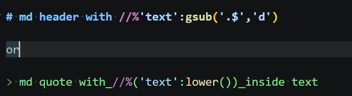

# Lua Syntax Injector for VS Code

VS Code extension for injecting lua code inside other files.

Mostly used for generate CRPG books by https://github.com/aneteanetes/mdbooksharp

## License
MIT - Nothing is promised, use at your own risk

## Common

You can write Lua code inside other files by `//%` sequence: 

## Limitations
This extension **is NOT** run lua code. But you can use https://github.com/aneteanetes/mdbooksharp for exec this lua injections

## Features

* Autocomplete lua code
* Go to definition
* Scan other Lua files inside directory

## Requirements

Tested only with `sumneko's` lua server.

## Known Issues

Unfortunately, lua servers need physical files for link with other files inside solution. By design, extension create temp file inside `.git` directory. 

## Development

95% vibecoded with `Gemini 3.5 Flash`:
* 281 generations
* ~1.500.000 tokens spent
* 43 context-resets
* Average context size: 1m-1.7m tokens
* ~20 hours of 'testing development'
* Worst descision ever

> You can track generations count by version postfix.

**Enjoy!**
